# 🏗️ SentinelRoad System Architecture

## Overview

SentinelRoad is a real-time road risk intelligence system that combines multiple data sources to identify high-risk locations on Pune's road network. The system uses a microservices-like architecture with modular components for data fetching, risk calculation, incident tracking, and visualization.

---

## Architecture Diagram

```mermaid
graph TB
    %% User Interface Layer
    subgraph UI["🖥️ User Interface Layer"]
        Dashboard["Streamlit Dashboard<br/>(app_v2.py)"]
        MapView["Interactive Map<br/>(Folium/Google Maps)"]
        Analytics["Incident Intelligence<br/>Dashboard"]
        DeepDive["Incident Deep Dive<br/>Explorer"]
    end

    %% Application Layer
    subgraph AppLayer["⚙️ Application Layer"]
        RiskCalc["Risk Calculator<br/>(Parallel Processing)"]
        IncidentProc["Incident Processor<br/>(Auto-Geocoding)"]
        CacheManager["Cache Manager<br/>(SQLite)"]
        SessionState["Session State<br/>Management"]
    end

    %% Core Services Layer
    subgraph CoreServices["🔧 Core Services"]
        RiskModel["Risk Scorer<br/>(6-component model)"]
        IncidentAnalytics["Incident Analytics<br/>(DBSCAN Clustering)"]
        GeocodingService["Geocoding Service<br/>(Location → Coords)"]
        RoadNetwork["Road Network Sampler<br/>(150 points)"]
    end

    %% API Integration Layer
    subgraph APIs["🌐 External APIs"]
        TomTom["TomTom API<br/>Traffic + Incidents + Roads"]
        GoogleMaps["Google Maps API<br/>Places + Speed Limits"]
        OSM["OpenStreetMap<br/>Infrastructure + POIs"]
        Weather["OpenWeatherMap<br/>Weather Conditions"]
    end

    %% Data Storage Layer
    subgraph Storage["💾 Data Storage"]
        Supabase["Supabase PostgreSQL<br/>- risk_scores<br/>- incidents<br/>- historical_risks"]
        SQLite["SQLite Cache<br/>- Traffic (5 min)<br/>- Weather (30 min)<br/>- OSM (24 hr)"]
    end

    %% API Client Layer
    subgraph APIClients["📡 API Client Layer"]
        TomTomClient["TomTomClient<br/>- get_traffic_flow()<br/>- get_incidents()<br/>- snap_to_roads()"]
        GoogleClient["GoogleMapsClient<br/>- get_nearby_places()<br/>- get_speed_limit()<br/>- reverse_geocode()"]
        OSMClient["OSMClient<br/>- get_infrastructure()<br/>- get_pois()<br/>- 3-server fallback"]
        WeatherClient["WeatherClient<br/>- get_current_weather()"]
    end

    %% Data Flow Connections
    Dashboard --> RiskCalc
    Dashboard --> IncidentProc
    Dashboard --> MapView
    Dashboard --> Analytics
    Analytics --> DeepDive
    
    RiskCalc --> RiskModel
    RiskCalc --> CacheManager
    IncidentProc --> IncidentAnalytics
    IncidentProc --> GeocodingService
    
    RiskModel --> TomTomClient
    RiskModel --> GoogleClient
    RiskModel --> OSMClient
    RiskModel --> WeatherClient
    
    IncidentAnalytics --> TomTomClient
    IncidentAnalytics --> Supabase
    GeocodingService --> GoogleClient
    RoadNetwork --> OSMClient
    
    TomTomClient --> TomTom
    GoogleClient --> GoogleMaps
    OSMClient --> OSM
    WeatherClient --> Weather
    
    CacheManager --> SQLite
    RiskCalc --> Supabase
    IncidentProc --> Supabase
    SessionState --> Dashboard

    %% Styling
    classDef uiClass fill:#E3F2FD,stroke:#1976D2,stroke-width:2px
    classDef appClass fill:#F3E5F5,stroke:#7B1FA2,stroke-width:2px
    classDef coreClass fill:#E8F5E9,stroke:#388E3C,stroke-width:2px
    classDef apiClass fill:#FFF3E0,stroke:#F57C00,stroke-width:2px
    classDef storageClass fill:#FCE4EC,stroke:#C2185B,stroke-width:2px
    classDef clientClass fill:#E0F2F1,stroke:#00897B,stroke-width:2px

    class Dashboard,MapView,Analytics,DeepDive uiClass
    class RiskCalc,IncidentProc,CacheManager,SessionState appClass
    class RiskModel,IncidentAnalytics,GeocodingService,RoadNetwork coreClass
    class TomTom,GoogleMaps,OSM,Weather apiClass
    class Supabase,SQLite storageClass
    class TomTomClient,GoogleClient,OSMClient,WeatherClient clientClass
```



---

## Component Details

### 🖥️ User Interface Layer

**Streamlit Dashboard (`app_v2.py`)**
- Main entry point for the application
- Responsive sidebar with configuration options
- Real-time data refresh controls
- Risk threshold filtering

**Interactive Map**
- **Folium**: Lightweight, fast, offline-capable
- **Google Maps**: Satellite/hybrid views, better UX
- Risk heatmap overlay
- Incident markers with color-coded priorities

**Incident Intelligence Dashboard**
- Key metrics (Total, Mobile, News, Official incidents)
- Category and source distribution charts
- Priority distribution visualization
- DBSCAN-identified high-risk clusters

**Incident Deep Dive Explorer**
- Multi-criteria filtering (category, priority, status, source)
- Full-text search
- Card view (all 21 fields) and Table view
- Pagination and CSV export

---

### ⚙️ Application Layer

**Risk Calculator (Parallel Processing)**
- ThreadPoolExecutor with 4-20 workers
- 5-10x speedup over sequential processing
- Thread-safe progress tracking
- Graceful error handling per location

**Incident Processor (Auto-Geocoding)**
- Automatic geocoding of NULL coordinates
- Google Maps Geocoding API with Pune bias
- Rate limiting (0.2s between requests)
- Database updates on successful geocoding

**Cache Manager (SQLite)**
- Traffic: 5-minute TTL
- Weather: 30-minute TTL
- OSM: 24-hour TTL
- 90% API call reduction

**Session State Management**
- Persistent across page refreshes
- Stores risk scores, incidents, raw data
- Last update timestamp tracking
- Force refresh flag

---

### 🔧 Core Services

**Risk Scorer (6-Component Model)**
```
Risk Score = 0.20×Traffic + 0.20×Weather + 0.15×Infrastructure 
           + 0.15×POI + 0.15×Incidents + 0.15×Speeding
```

Components:
- **Traffic Anomaly**: Speed vs. free-flow comparison
- **Weather Risk**: Rain, fog, visibility, night hours
- **Infrastructure Risk**: Signals, junctions, unlit roads
- **POI Risk**: Schools, bars, bus stops (- hospitals)
- **Incident Risk**: Distance-weighted severity scores
- **Speeding Risk**: Current speed vs. posted limits

**Incident Analytics (DBSCAN Clustering)**
- Spatial clustering with eps=0.5km, min_samples=2
- Risk level classification (critical/high/medium/low)
- Category and source aggregation per cluster
- Heatmap data generation with priority weighting

**Geocoding Service**
- Location text → (latitude, longitude)
- Google Maps Geocoding API
- Pune metropolitan area bias
- Filters invalid inputs (URLs, empty strings)

**Road Network Sampler**
- OSM Overpass API queries
- Samples major roads (motorway, trunk, primary)
- 500-meter intervals along road centerlines
- Priority-based selection if >150 points
- Grid fallback when OSM unavailable

---

### 🌐 External APIs

**TomTom Traffic APIs**
- Traffic Flow API: Real-time speeds
- Traffic Incidents API: Accidents, closures, works
- Snap to Roads API: Road name and type matching
- Reverse Geocode API: Address lookup
- Rate Limit: 2,500 requests/day (free tier)

**Google Maps Platform**
- Places API: Nearby POIs with types/ratings
- Roads API: Speed limits (most accurate)
- Geocoding API: Location text conversion
- Rate Limit: $200/month credit (~10K requests)

**OpenStreetMap (Overpass API)**
- Infrastructure features (signals, junctions, crossings)
- POI data (schools, hospitals, bars, transit)
- 3-server fallback (main, kumi, russian)
- No rate limits, but courtesy delays

**OpenWeatherMap**
- Current weather conditions
- Visibility, precipitation, temperature
- Rate Limit: 1,000 requests/day (free tier)

---

### 💾 Data Storage

**Supabase PostgreSQL**

`risk_scores` table:
- location (lat, lon), risk_score, risk_level
- Component contributions (traffic, weather, etc.)
- Road metadata (name, type, speed_limit)
- Timestamp for historical analysis

`incidents` table (21 fields):
- Basic: id, title, summary, reason, priority, status
- Location: location_text, latitude, longitude
- Timeline: created_at, occurred_at, updated_at
- Response: required_skills, actions_needed, resolution_steps
- Resources: estimated_volunteers, assigned_to, assigned_count
- Evidence: photo_url, reporter_id, source

`historical_risks` table:
- Aggregated daily/weekly risk trends
- Location-based hotspot tracking
- Time-series analysis for predictions

**SQLite Cache (`data/cache.db`)**
- API response caching with TTL
- Reduces redundant API calls
- Supports offline operation with stale data
- Auto-cleanup of expired entries

---

### 📡 API Client Layer

**TomTomClient**
- Manages TomTom API authentication
- Implements retry logic with exponential backoff
- Parses traffic flow and incident responses
- Handles snap-to-roads and reverse geocoding

**GoogleMapsClient**
- Google Maps Platform client
- Places, Roads, Geocoding API wrappers
- Enhanced POI risk calculation
- Speeding risk detection

**OSMClient**
- Overpass API query builder
- 3-server fallback mechanism
- Infrastructure feature extraction
- POI filtering by distance

**WeatherClient**
- OpenWeatherMap API wrapper
- Current weather fetching
- Basic error handling and retries

---

## Data Flow

### Risk Calculation Flow

```
1. User triggers "Refresh Data" or initial load
2. Road Network Sampler generates 150 sample points
3. Parallel workers (4-20 threads) fetch data:
   ├─ TomTom: Traffic flow for each location
   ├─ Weather: Single fetch for Pune center
   ├─ OSM: Batch fetch infrastructure features
   └─ Google/OSM: POI data per location (cached)
4. Risk Scorer calculates 6-component score per location
5. Results stored in Supabase + session state
6. Dashboard renders interactive map + analytics
```

### Incident Processing Flow

```
1. Fetch TomTom incidents (real-time official data)
2. Fetch Supabase incidents (last 7 days)
   ├─ Filter by bounding box
   ├─ Auto-geocode NULL coordinates
   └─ Update database with new coordinates
3. Categorize incidents (accidents, works, closures, etc.)
4. Merge TomTom + Supabase incidents
5. Run DBSCAN clustering for high-risk zones
6. Generate analytics and heatmap data
7. Display in dashboard + deep dive explorer
```

### Caching Strategy

```
Cache Miss:
├─ Fetch fresh data from API
├─ Store in SQLite with timestamp
└─ Return data to caller

Cache Hit:
├─ Check TTL (5min/30min/24hr)
├─ If expired: Treat as cache miss
└─ If valid: Return cached data
```

---

## Performance Optimizations

### Parallel Processing
- **Before**: Sequential processing, 2-5 minutes for 150 locations
- **After**: ThreadPoolExecutor, 15-30 seconds (5-10x faster)
- **Scaling**: Auto-scales workers based on location count

### Smart Caching
- **Traffic**: 5-minute TTL (balance freshness vs. cost)
- **Weather**: 30-minute TTL (changes slowly)
- **OSM**: 24-hour TTL (static infrastructure)
- **Result**: 90% reduction in API calls

### Batch Operations
- POI risk calculation: Batch filter instead of per-location queries
- Incident storage: Batch insert to Supabase (100x faster)
- Road network sampling: Single OSM query for all roads

### API Fallbacks
- OSM: 3-server fallback (99%+ uptime)
- POI: OSM ↔ Google Maps toggle
- Grid sampling: Fallback when OSM unavailable

---

## Scalability Considerations

### Current Scale
- **Locations**: 150 sample points
- **API Calls**: ~200-300 per refresh
- **Processing Time**: 15-30 seconds
- **Database**: ~1,000 risk scores/day

### Scaling to 1,000+ Locations
- Increase worker count to 50-100
- Implement request batching (TomTom supports bulk)
- Use Redis for distributed caching
- Deploy on cloud with auto-scaling

### Scaling to Multiple Cities
- City-specific bounding boxes
- Separate cache databases per city
- Regional API servers (if available)
- Multi-tenancy in Supabase

---

## Security & Privacy

### API Key Management
- Environment variables (.env file)
- Never committed to version control
- Server-side key validation

### Data Privacy
- No personal user data collected
- Incident reporter_id anonymized
- Photo URLs stored but not analyzed
- GDPR-compliant data retention (7 days)

### Database Security
- Supabase Row Level Security (RLS)
- API key-based authentication
- HTTPS for all external API calls

---

## Future Enhancements

### Planned Features
- **Predictive Analytics**: ML model for risk forecasting
- **Mobile App**: React Native citizen reporting app
- **Alert System**: Real-time notifications for critical risks
- **Route Optimization**: Safest path recommendations
- **Historical Trends**: Multi-month risk analysis

### Technical Improvements
- **WebSockets**: Real-time dashboard updates
- **PostgreSQL Functions**: Server-side risk aggregation
- **CDN**: Cached map tiles for faster loading
- **GraphQL**: Flexible incident data queries
- **Kubernetes**: Container orchestration for HA

---

## Deployment Architecture

### Current (Development)
```
Local Machine
├─ Streamlit Server (port 8502)
├─ SQLite Cache
└─ External API calls
```

### Recommended (Production)
```
Cloud Platform (AWS/GCP/Azure)
├─ Load Balancer
├─ Streamlit Containers (Auto-scaling)
├─ Redis Cluster (Distributed cache)
├─ Supabase Postgres (Managed DB)
└─ CloudWatch/Datadog (Monitoring)
```

---

## Technology Stack

| Layer | Technology | Purpose |
|-------|-----------|---------|
| Frontend | Streamlit | Interactive dashboard |
| Visualization | Folium, Plotly, Google Maps | Maps and charts |
| Backend | Python 3.12 | Core logic |
| Risk Model | NumPy, scikit-learn | DBSCAN clustering |
| Database | Supabase PostgreSQL | Persistent storage |
| Cache | SQLite | Local API cache |
| APIs | TomTom, Google Maps, OSM, OpenWeatherMap | Data sources |
| Deployment | Docker, Kubernetes (future) | Container orchestration |

---

## API Rate Limits & Costs

| Service | Free Tier | Cost After |
|---------|-----------|------------|
| TomTom | 2,500 req/day | $0.50-$2.00 per 1,000 |
| Google Maps | $200 credit/month | ~$5-$20 per 1,000 |
| OpenStreetMap | Unlimited (courtesy) | Free (OSM license) |
| OpenWeatherMap | 1,000 req/day | $40/month for 100K |
| Supabase | 500MB DB, 2GB bandwidth | $25/month for Pro |

**Current Daily Cost**: ~$0.10-$0.50 (within free tiers)
**Production Cost**: ~$100-$200/month (1,000 locations, hourly refresh)
