# 🎨 SentinelRoad Comprehensive Architecture - Mermaid Diagrams

This document contains multiple Mermaid diagrams for different aspects of the SentinelRoad system architecture.

---

## 1. High-Level System Architecture

```mermaid
graph TB
    subgraph External["🌍 External Data Sources"]
        TomTomAPI["TomTom Traffic API<br/>2,500 req/day"]
        GoogleAPI["Google Maps Platform<br/>$200 credit/month"]
        OSM["OpenStreetMap Overpass<br/>Unlimited (courtesy)"]
        Weather["OpenWeatherMap<br/>1,000 req/day"]
        NewsAI["News Intelligence AI<br/>(Future Module)"]
        MobileApp["Mobile Crowdsourcing<br/>(Future Module)"]
    end

    subgraph Frontend["🖥️ Frontend Layer - Streamlit Dashboard"]
        MainUI["Main Dashboard<br/>Risk Threshold Controls<br/>Data Refresh"]
        MapViz["Interactive Mapping<br/>- Folium (default)<br/>- Google Maps (satellite)"]
        IncidentDash["Incident Intelligence<br/>Charts & Metrics"]
        DeepDive["Deep Dive Explorer<br/>21-field incident details"]
    end

    subgraph Application["⚙️ Application Logic Layer"]
        RiskEngine["Parallel Risk Calculator<br/>ThreadPoolExecutor<br/>4-20 workers"]
        IncidentEngine["Incident Processor<br/>Auto-Geocoding<br/>DBSCAN Clustering"]
        SessionMgr["Session State Manager<br/>Persistent Data"]
        CacheMgr["Cache Manager<br/>SQLite + TTL"]
    end

    subgraph Core["🔧 Core Services"]
        RiskModel["6-Component Risk Scorer<br/>Traffic + Weather + Infra<br/>+ POI + Incidents + Speeding"]
        Analytics["Incident Analytics<br/>DBSCAN (eps=0.5km)<br/>Risk Level Classification"]
        Geocoder["Geocoding Service<br/>Google Maps API<br/>Pune bias + URL filter"]
        RoadSampler["Road Network Sampler<br/>OSM + 500m intervals<br/>150 sample points"]
    end

    subgraph Clients["📡 API Client Layer"]
        TomTomClient["TomTomClient<br/>- Traffic Flow<br/>- Incidents<br/>- Snap to Roads<br/>- Speed Limits"]
        GoogleClient["GoogleMapsClient<br/>- Places API<br/>- Roads API<br/>- Geocoding API"]
        OSMClient["OSMClient<br/>- Overpass queries<br/>- 3-server fallback<br/>- Infrastructure + POIs"]
        WeatherClient["WeatherClient<br/>- Current conditions<br/>- Visibility data"]
    end

    subgraph Storage["💾 Data Storage"]
        Supabase[("Supabase PostgreSQL<br/>☁️ Cloud Database<br/>━━━━━━━━━━━<br/>📊 risk_scores (location, score, components)<br/>🚨 incidents (21 fields incl. skills, actions)<br/>📈 historical_risks (trends)<br/>🚗 traffic_data (cache)<br/>🌤️ weather_data (cache)")]
        SQLite[("SQLite Cache<br/>💽 Local Database<br/>━━━━━━━━━━━<br/>⚡ Traffic: 5 min TTL<br/>🌤️ Weather: 30 min TTL<br/>🗺️ OSM: 24 hr TTL<br/>📍 POIs: cached")]
    end

    %% Connections - External to Clients
    TomTomAPI -.->|REST API| TomTomClient
    GoogleAPI -.->|REST API| GoogleClient
    OSM -.->|Overpass QL| OSMClient
    Weather -.->|REST API| WeatherClient
    
    %% Connections - Clients to Core
    TomTomClient -->|Traffic Data| RiskModel
    TomTomClient -->|Incidents| Analytics
    GoogleClient -->|POI Data| RiskModel
    GoogleClient -->|Speed Limits| RiskModel
    GoogleClient -->|Geocoding| Geocoder
    OSMClient -->|Infrastructure| RiskModel
    OSMClient -->|Road Network| RoadSampler
    WeatherClient -->|Conditions| RiskModel
    
    %% Connections - Core to Application
    RiskModel -->|Risk Scores| RiskEngine
    Analytics -->|Clusters| IncidentEngine
    Geocoder -->|Coordinates| IncidentEngine
    RoadSampler -->|Sample Points| RiskEngine
    
    %% Connections - Application to Storage
    RiskEngine -->|Store Scores| Supabase
    IncidentEngine -->|Store Incidents| Supabase
    CacheMgr -->|Read/Write| SQLite
    RiskEngine -->|Check Cache| CacheMgr
    
    %% Connections - Application to Frontend
    RiskEngine -->|Risk Data| MainUI
    IncidentEngine -->|Incident Data| IncidentDash
    SessionMgr -->|State| MainUI
    
    %% Frontend internal
    MainUI -->|Controls| MapViz
    IncidentDash -->|Drill Down| DeepDive
    MapViz -->|Display| IncidentDash
    
    %% Bidirectional feedback
    MainUI -->|Trigger Refresh| RiskEngine
    DeepDive -->|Filter/Search| IncidentEngine
    
    %% Future modules (dotted)
    NewsAI -.->|Write Incidents| Supabase
    MobileApp -.->|Crowdsource Reports| Supabase
    Supabase -.->|Read Risks| MobileApp

    %% Styling
    classDef external fill:#FFE082,stroke:#F57F17,stroke-width:3px,color:#000
    classDef frontend fill:#81D4FA,stroke:#0277BD,stroke-width:3px,color:#000
    classDef application fill:#CE93D8,stroke:#6A1B9A,stroke-width:3px,color:#000
    classDef core fill:#A5D6A7,stroke:#2E7D32,stroke-width:3px,color:#000
    classDef clients fill:#80DEEA,stroke:#00838F,stroke-width:3px,color:#000
    classDef storage fill:#EF9A9A,stroke:#C62828,stroke-width:3px,color:#000
    classDef future fill:#E0E0E0,stroke:#616161,stroke-width:2px,stroke-dasharray: 5 5,color:#424242

    class TomTomAPI,GoogleAPI,OSM,Weather external
    class NewsAI,MobileApp future
    class MainUI,MapViz,IncidentDash,DeepDive frontend
    class RiskEngine,IncidentEngine,SessionMgr,CacheMgr application
    class RiskModel,Analytics,Geocoder,RoadSampler core
    class TomTomClient,GoogleClient,OSMClient,WeatherClient clients
    class Supabase,SQLite storage
```



---

## 2. Data Flow Sequence Diagram

```mermaid
sequenceDiagram
    participant User
    participant Dashboard
    participant RiskCalc
    participant Cache
    participant APIs
    participant RiskModel
    participant Supabase
    
    User->>Dashboard: Click "Refresh Data"
    Dashboard->>RiskCalc: Trigger risk calculation
    
    par Parallel Data Fetching (4-20 workers)
        RiskCalc->>Cache: Check traffic cache
        alt Cache Hit (< 5 min old)
            Cache-->>RiskCalc: Return cached traffic
        else Cache Miss
            Cache->>APIs: Fetch TomTom traffic
            APIs-->>Cache: Traffic data
            Cache-->>RiskCalc: Fresh traffic data
        end
        
        RiskCalc->>Cache: Check weather cache
        alt Cache Hit (< 30 min old)
            Cache-->>RiskCalc: Return cached weather
        else Cache Miss
            Cache->>APIs: Fetch OpenWeather
            APIs-->>Cache: Weather data
            Cache-->>RiskCalc: Fresh weather data
        end
        
        RiskCalc->>Cache: Check OSM cache
        alt Cache Hit (< 24 hr old)
            Cache-->>RiskCalc: Return cached OSM
        else Cache Miss
            Cache->>APIs: Fetch OSM infrastructure
            APIs-->>Cache: OSM data
            Cache-->>RiskCalc: Fresh OSM data
        end
        
        RiskCalc->>APIs: Fetch Google POIs (per location)
        APIs-->>RiskCalc: POI data (cached)
    end
    
    RiskCalc->>RiskModel: Calculate risk (150 locations × 6 components)
    RiskModel-->>RiskCalc: Risk scores array
    
    RiskCalc->>Supabase: Batch store risk scores
    Supabase-->>RiskCalc: Confirmation
    
    RiskCalc-->>Dashboard: Risk scores + metadata
    Dashboard-->>User: Display interactive map (15-30s)
    
    Note over User,Supabase: Parallel processing: 5-10x faster than sequential
```



---

## 3. Risk Calculation Component Breakdown

```mermaid
graph LR
    subgraph Input["📥 Input Data"]
        Location["Location<br/>(lat, lon)"]
        Traffic["Traffic Data<br/>current_speed<br/>free_flow_speed"]
        Weather["Weather Data<br/>condition<br/>visibility<br/>hour"]
        Infrastructure["Infrastructure<br/>signals<br/>junctions<br/>crossings<br/>unlit_roads"]
        POI["POI Data<br/>schools<br/>hospitals<br/>bars<br/>bus_stops"]
        Incidents["Incidents<br/>accidents<br/>works<br/>closures<br/>protests"]
        SpeedLimit["Speed Limit<br/>posted_limit<br/>current_speed"]
    end
    
    subgraph Components["⚙️ Risk Components (0-1 scale)"]
        TrafficRisk["Traffic Anomaly<br/>weight: 0.20<br/>━━━━━━━━━━━<br/>Congestion factor<br/>Speed deviation"]
        WeatherRisk["Weather Risk<br/>weight: 0.20<br/>━━━━━━━━━━━<br/>Rain/fog/snow<br/>Visibility<br/>Night hours"]
        InfraRisk["Infrastructure Risk<br/>weight: 0.15<br/>━━━━━━━━━━━<br/>Junction density<br/>Unlit roads<br/>Signal count"]
        POIRisk["POI Risk<br/>weight: 0.15<br/>━━━━━━━━━━━<br/>+Schools (0.4)<br/>+Bars (0.5)<br/>+Bus stops (0.3)<br/>-Hospitals (0.2)"]
        IncidentRisk["Incident Risk<br/>weight: 0.15<br/>━━━━━━━━━━━<br/>Distance-weighted<br/>Severity multiplier<br/>Source trust"]
        SpeedingRisk["Speeding Risk<br/>weight: 0.15<br/>━━━━━━━━━━━<br/>Speed vs limit<br/>Over-limit %<br/>Critical if >50%"]
    end
    
    subgraph Output["📊 Output"]
        Calculation["Weighted Sum<br/>━━━━━━━━━━━<br/>Score = Σ(weight × risk)<br/>× 100"]
        Score["Risk Score<br/>0-100"]
        Level["Risk Level<br/>━━━━━━━━━━━<br/>🟢 Low: 0-29<br/>🟡 Medium: 30-59<br/>🟠 High: 60-79<br/>🔴 Critical: 80-100"]
        Details["Component Details<br/>━━━━━━━━━━━<br/>Individual scores<br/>Contributing factors<br/>Metadata"]
    end
    
    Traffic -->|Analyze| TrafficRisk
    Weather -->|Analyze| WeatherRisk
    Infrastructure -->|Analyze| InfraRisk
    POI -->|Analyze| POIRisk
    Incidents -->|Analyze| IncidentRisk
    SpeedLimit -->|Analyze| SpeedingRisk
    
    TrafficRisk -->|0.20 × score| Calculation
    WeatherRisk -->|0.20 × score| Calculation
    InfraRisk -->|0.15 × score| Calculation
    POIRisk -->|0.15 × score| Calculation
    IncidentRisk -->|0.15 × score| Calculation
    SpeedingRisk -->|0.15 × score| Calculation
    
    Calculation -->|Normalize| Score
    Score -->|Classify| Level
    TrafficRisk & WeatherRisk & InfraRisk & POIRisk & IncidentRisk & SpeedingRisk -->|Aggregate| Details
    
    Score & Level & Details -->|Return| Output
    
    classDef inputClass fill:#FFF9C4,stroke:#F57F17,stroke-width:2px
    classDef componentClass fill:#C8E6C9,stroke:#2E7D32,stroke-width:2px
    classDef outputClass fill:#FFCCBC,stroke:#D84315,stroke-width:2px
    
    class Location,Traffic,Weather,Infrastructure,POI,Incidents,SpeedLimit inputClass
    class TrafficRisk,WeatherRisk,InfraRisk,POIRisk,IncidentRisk,SpeedingRisk componentClass
    class Calculation,Score,Level,Details outputClass
```



---

## 4. Incident Processing Pipeline

```mermaid
graph TB
    subgraph Sources["📡 Incident Sources"]
        TomTomInc["TomTom Incidents API<br/>Real-time official data<br/>Verified, accurate"]
        SupabaseInc["Supabase Incidents Table<br/>Last 7 days<br/>May have NULL coords"]
        FutureNews["News AI Scraper<br/>(Future)<br/>AI-classified incidents"]
        FutureMobile["Mobile App Reports<br/>(Future)<br/>Crowdsourced data"]
    end
    
    subgraph Fetch["🔄 Fetch & Filter"]
        FetchTT["Fetch TomTom<br/>Current + active<br/>Within bbox"]
        FetchDB["Fetch Supabase<br/>hours_back=168<br/>Filter by bbox"]
        CheckCoords["Check Coordinates<br/>Separate NULL vs valid"]
    end
    
    subgraph Geocode["🌍 Auto-Geocoding"]
        ValidateText["Validate location_text<br/>Skip if URL/empty<br/>Skip if starts with 'http'"]
        CallAPI["Google Geocoding API<br/>Pune geographic bias<br/>0.2s rate limit"]
        UpdateDB["Update Database<br/>SET latitude, longitude<br/>WHERE id = ?"]
    end
    
    subgraph Categorize["📂 Categorization"]
        ParseReason["Parse 'reason' field<br/>accident, crash, collision<br/>construction, roadwork<br/>closure, blocked<br/>weather, flood, fog<br/>protest, rally, event"]
        SourceDetect["Detect Source<br/>mobile_upload<br/>news_scraper (http/google_news)<br/>tomtom"]
        Merge["Merge Categories<br/>accidents: []<br/>road_works: []<br/>closures: []<br/>protests: []<br/>...other: []"]
    end
    
    subgraph Analytics["📊 Analytics Processing"]
        DBSCAN["DBSCAN Clustering<br/>eps_km = 0.5<br/>min_samples = 2<br/>Find spatial clusters"]
        CalcRisk["Calculate Cluster Risk<br/>Count by priority<br/>>=5 incidents = critical<br/>>=3 high-priority = critical"]
        Aggregate["Aggregate Stats<br/>By category<br/>By source<br/>By priority"]
        Heatmap["Generate Heatmap Data<br/>Weight by priority<br/>low=2, medium=3<br/>high=4, critical=5"]
    end
    
    subgraph Output["📤 Output"]
        CategorizedInc["Categorized Incidents<br/>Dict[category, List[incidents]]"]
        Clusters["High-Risk Clusters<br/>Top 5 by incident count<br/>With risk levels"]
        Stats["Distribution Stats<br/>Total, mobile, news, official<br/>By category/source/priority"]
        HeatmapData["Heatmap Data<br/>List[(lat, lon, weight)]"]
    end
    
    subgraph Display["🖥️ Dashboard Display"]
        Metrics["Key Metrics Cards<br/>Total, Mobile, News, Official"]
        Charts["Interactive Charts<br/>Pie: by category<br/>Bar: by source<br/>Bar: by priority"]
        ClusterExpander["Cluster Expandables<br/>Show details per cluster<br/>Location, categories, sources"]
        DeepDiveUI["Deep Dive Explorer<br/>Filter, search, paginate<br/>Card/Table view<br/>21-field details"]
    end
    
    TomTomInc -->|Always valid coords| FetchTT
    SupabaseInc -->|May have NULLs| FetchDB
    FutureNews -.->|Future| FetchDB
    FutureMobile -.->|Future| FetchDB
    
    FetchTT -->|Verified incidents| Merge
    FetchDB --> CheckCoords
    
    CheckCoords -->|NULL coords| ValidateText
    CheckCoords -->|Valid coords| Merge
    
    ValidateText -->|Valid location_text| CallAPI
    ValidateText -->|Invalid (URL)| Skip["❌ Skip geocoding"]
    
    CallAPI -->|Success| UpdateDB
    CallAPI -->|Failure| Skip
    
    UpdateDB -->|Now has coords| Merge
    
    Merge --> ParseReason
    ParseReason --> SourceDetect
    SourceDetect --> CategorizedInc
    
    CategorizedInc --> DBSCAN
    CategorizedInc --> Aggregate
    CategorizedInc --> Heatmap
    
    DBSCAN --> CalcRisk
    CalcRisk --> Clusters
    Aggregate --> Stats
    
    CategorizedInc --> Metrics
    Stats --> Metrics
    Stats --> Charts
    Clusters --> ClusterExpander
    CategorizedInc --> DeepDiveUI
    HeatmapData --> MapViz["Map Visualization"]
    
    classDef sourceClass fill:#E1BEE7,stroke:#7B1FA2,stroke-width:2px
    classDef processClass fill:#BBDEFB,stroke:#1976D2,stroke-width:2px
    classDef analyticsClass fill:#C5E1A5,stroke:#558B2F,stroke-width:2px
    classDef outputClass fill:#FFCCBC,stroke:#E64A19,stroke-width:2px
    classDef displayClass fill:#B2DFDB,stroke:#00897B,stroke-width:2px
    classDef futureClass fill:#EEEEEE,stroke:#757575,stroke-width:2px,stroke-dasharray: 5 5
    
    class TomTomInc,SupabaseInc sourceClass
    class FutureNews,FutureMobile futureClass
    class FetchTT,FetchDB,CheckCoords,ValidateText,CallAPI,UpdateDB,ParseReason,SourceDetect,Merge processClass
    class DBSCAN,CalcRisk,Aggregate,Heatmap analyticsClass
    class CategorizedInc,Clusters,Stats,HeatmapData outputClass
    class Metrics,Charts,ClusterExpander,DeepDiveUI displayClass
```

---

## 5. Database Schema (Entity-Relationship Diagram)


---

## 6. Performance Optimization Flow

```mermaid
graph LR
    subgraph Before["❌ Before Optimization"]
        SeqStart["Start"]
        Loc1["Location 1<br/>Fetch + Calculate<br/>~2 seconds"]
        Loc2["Location 2<br/>Fetch + Calculate<br/>~2 seconds"]
        Loc3["Location 3<br/>Fetch + Calculate<br/>~2 seconds"]
        LocN["...<br/>150 locations<br/>~300 seconds (5 min)"]
        SeqEnd["End<br/>Total: 5 min"]
        
        SeqStart --> Loc1 --> Loc2 --> Loc3 --> LocN --> SeqEnd
    end
    
    subgraph After["✅ After Optimization"]
        ParStart["Start<br/>ThreadPoolExecutor"]
        
        subgraph Worker1["Worker 1"]
            W1L1["Loc 1-10<br/>15 seconds"]
        end
        
        subgraph Worker2["Worker 2"]
            W2L1["Loc 11-20<br/>15 seconds"]
        end
        
        subgraph Worker3["Worker 3"]
            W3L1["Loc 21-30<br/>15 seconds"]
        end
        
        subgraph WorkerN["Workers 4-20"]
            WNL1["Loc 31-150<br/>15 seconds"]
        end
        
        ParEnd["End<br/>Total: 15-30 sec<br/>⚡ 10x faster"]
        
        ParStart -.-> Worker1
        ParStart -.-> Worker2
        ParStart -.-> Worker3
        ParStart -.-> WorkerN
        
        W1L1 -.-> ParEnd
        W2L1 -.-> ParEnd
        W3L1 -.-> ParEnd
        WNL1 -.-> ParEnd
    end
    
    subgraph Caching["💾 Smart Caching"]
        Check["Check Cache"]
        Hit["Cache HIT<br/>Return immediately<br/>~0.001 sec"]
        Miss["Cache MISS<br/>Fetch from API<br/>~1-2 sec"]
        Store["Store in cache<br/>with TTL"]
        
        Check -->|"90% of requests"| Hit
        Check -->|"10% of requests"| Miss
        Miss --> Store
    end
    
    Before -.->|"Replaced with"| After
    After -->|"Uses"| Caching
    
    style SeqEnd fill:#FFCDD2,stroke:#C62828,stroke-width:3px
    style ParEnd fill:#C8E6C9,stroke:#2E7D32,stroke-width:3px
    style Hit fill:#A5D6A7,stroke:#388E3C,stroke-width:2px
    style Miss fill:#FFAB91,stroke:#D84315,stroke-width:2px
```



---

## 7. Future Module Integration

```mermaid
graph TB
    subgraph Current["✅ Current System (v1.0)"]
        Dashboard["Admin Dashboard<br/>Streamlit<br/>━━━━━━━━━━━<br/>Visualization<br/>Risk monitoring"]
        CurrentDB[("Supabase Database<br/>━━━━━━━━━━━<br/>Unified incidents table<br/>Risk scores<br/>Historical data")]
        CurrentAPIs["Official APIs<br/>━━━━━━━━━━━<br/>TomTom Traffic<br/>Google Maps<br/>OpenStreetMap<br/>OpenWeatherMap"]
    end
    
    subgraph Future1["🚧 Future Module 1: News AI (v2.0)"]
        NewsScraper["News Scraper<br/>━━━━━━━━━━━<br/>RSS feeds<br/>Web crawlers<br/>Twitter/X API"]
        LLMService["LLM Classification<br/>━━━━━━━━━━━<br/>GPT-4 / Claude<br/>Gemini Pro<br/>━━━━━━━━━━━<br/>Extract:<br/>• Location<br/>• Incident type<br/>• Severity<br/>• Timestamp"]
        NewsAPI["FastAPI Service<br/>━━━━━━━━━━━<br/>Scheduled jobs<br/>Webhook endpoints<br/>Real-time processing"]
    end
    
    subgraph Future2["🚧 Future Module 2: Mobile App (v3.0)"]
        MobileUI["React Native UI<br/>━━━━━━━━━━━<br/>Expo framework<br/>Cross-platform<br/>iOS + Android"]
        MobileFeatures["User Features<br/>━━━━━━━━━━━<br/>📸 Report incidents<br/>📍 GPS location<br/>🗺️ View risk map<br/>🏆 Gamification<br/>⚡ Real-time alerts"]
        MobileDB["User Profiles<br/>━━━━━━━━━━━<br/>Points system<br/>Badges<br/>Leaderboards<br/>Verified reports"]
    end
    
    Dashboard -->|"Read risk scores"| CurrentDB
    Dashboard -->|"Fetch data"| CurrentAPIs
    CurrentAPIs -.->|"Official incidents"| CurrentDB
    
    NewsScraper -->|"Raw articles"| LLMService
    LLMService -->|"Classified incidents"| NewsAPI
    NewsAPI -.->|"Write to incidents table"| CurrentDB
    
    MobileUI -->|"User reports"| MobileFeatures
    MobileFeatures -.->|"Write crowdsourced data"| CurrentDB
    MobileFeatures -.->|"Read/write"| MobileDB
    CurrentDB -.->|"Risk data"| MobileUI
    
    Dashboard -.->|"Reads news incidents"| CurrentDB
    Dashboard -.->|"Reads mobile reports"| CurrentDB
    
    CurrentDB -.->|"Unified data source"| NewsAPI
    CurrentDB -.->|"Unified data source"| MobileFeatures
    
    classDef currentClass fill:#81C784,stroke:#2E7D32,stroke-width:3px,color:#000
    classDef futureClass fill:#FFB74D,stroke:#E65100,stroke-width:3px,color:#000,stroke-dasharray: 5 5
    classDef dbClass fill:#EF5350,stroke:#B71C1C,stroke-width:3px,color:#fff
    
    class Dashboard,CurrentAPIs currentClass
    class NewsScraper,LLMService,NewsAPI,MobileUI,MobileFeatures,MobileDB futureClass
    class CurrentDB dbClass
```



---

## 8. Deployment Architecture

```mermaid
graph TB
    subgraph Users["👥 End Users"]
        Admin["Traffic Authority<br/>Dashboard Users"]
        Public["Pune Citizens<br/>(Future Mobile App)"]
    end
    
    subgraph LoadBalancer["⚖️ Load Balancer"]
        LB["Nginx / AWS ALB<br/>━━━━━━━━━━━<br/>SSL Termination<br/>Rate Limiting<br/>DDoS Protection"]
    end
    
    subgraph AppServers["🖥️ Application Servers (Auto-scaling)"]
        Container1["Streamlit Container 1<br/>Docker<br/>8GB RAM"]
        Container2["Streamlit Container 2<br/>Docker<br/>8GB RAM"]
        ContainerN["Streamlit Container N<br/>Auto-scale 2-10<br/>based on load"]
    end
    
    subgraph Cache["⚡ Distributed Cache"]
        Redis["Redis Cluster<br/>━━━━━━━━━━━<br/>Traffic: 5 min<br/>Weather: 30 min<br/>OSM: 24 hr<br/>━━━━━━━━━━━<br/>3-node cluster<br/>High availability"]
    end
    
    subgraph Database["💾 Database Cluster"]
        Supabase["Supabase PostgreSQL<br/>━━━━━━━━━━━<br/>Primary + Read Replicas<br/>Auto-backups<br/>Point-in-time recovery"]
    end
    
    subgraph APIs["🌐 External APIs"]
        TomTom["TomTom API"]
        Google["Google Maps"]
        OSM["OpenStreetMap"]
        Weather["OpenWeatherMap"]
    end
    
    subgraph Monitoring["📊 Monitoring & Logging"]
        Metrics["CloudWatch / Datadog<br/>━━━━━━━━━━━<br/>CPU, Memory, Latency<br/>Request rates<br/>Error rates"]
        Logs["Centralized Logging<br/>━━━━━━━━━━━<br/>ELK Stack / Papertrail<br/>Application logs<br/>Audit trails"]
        Alerts["Alert System<br/>━━━━━━━━━━━<br/>PagerDuty / Slack<br/>Critical errors<br/>Performance degradation"]
    end
    
    Admin -->|"HTTPS"| LB
    Public -.->|"Future"| LB
    
    LB --> Container1
    LB --> Container2
    LB --> ContainerN
    
    Container1 & Container2 & ContainerN -->|"Check cache"| Redis
    Container1 & Container2 & ContainerN -->|"Read/Write"| Supabase
    Container1 & Container2 & ContainerN -->|"API calls"| APIs
    
    Container1 & Container2 & ContainerN -->|"Metrics"| Metrics
    Container1 & Container2 & ContainerN -->|"Logs"| Logs
    
    Metrics -->|"Trigger"| Alerts
    Logs -->|"Error detection"| Alerts
    
    classDef userClass fill:#B39DDB,stroke:#512DA8,stroke-width:2px
    classDef lbClass fill:#90CAF9,stroke:#1565C0,stroke-width:3px
    classDef appClass fill:#A5D6A7,stroke:#2E7D32,stroke-width:2px
    classDef cacheClass fill:#FFE082,stroke:#F57C00,stroke-width:2px
    classDef dbClass fill:#EF9A9A,stroke:#C62828,stroke-width:3px
    classDef apiClass fill:#FFCCBC,stroke:#D84315,stroke-width:2px
    classDef monitorClass fill:#B0BEC5,stroke:#455A64,stroke-width:2px
    
    class Admin,Public userClass
    class LB lbClass
    class Container1,Container2,ContainerN appClass
    class Redis cacheClass
    class Supabase dbClass
    class TomTom,Google,OSM,Weather apiClass
    class Metrics,Logs,Alerts monitorClass
```



---

## Usage Instructions

Each diagram serves a different purpose:

1. **High-Level Architecture**: Overall system overview for stakeholders
2. **Data Flow Sequence**: Detailed request-response flow for developers
3. **Risk Calculation**: Mathematical model explanation for technical docs
4. **Incident Processing**: Pipeline for incident data handling
5. **Database Schema**: Entity relationships for database design
6. **Performance Optimization**: Before/after comparison for optimization showcase
7. **Future Modules**: Roadmap visualization for planning
8. **Deployment Architecture**: Production deployment for DevOps

To render these diagrams:
- Copy the mermaid code block
- Paste into [Mermaid Live Editor](https://mermaid.live)
- Or use in Markdown-supporting platforms (GitHub, GitLab, Notion, etc.)
- Or integrate into documentation with Mermaid plugins

---

## Styling Guide

The diagrams use color-coding for clarity:
- 🟦 **Blue**: User Interface / Frontend
- 🟪 **Purple**: Application Logic
- 🟩 **Green**: Core Services / Success states
- 🟨 **Yellow**: External APIs / Cache
- 🟥 **Red**: Data Storage / Critical
- ⬜ **Gray**: Future modules / Optional components

All diagrams are designed to be:
- **Print-friendly**: Clear in black & white
- **Accessible**: Color-blind safe palette
- **Scalable**: SVG output from Mermaid
- **Professional**: Suitable for technical presentations
